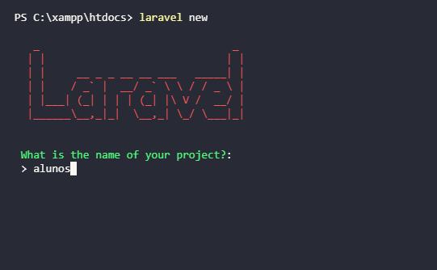
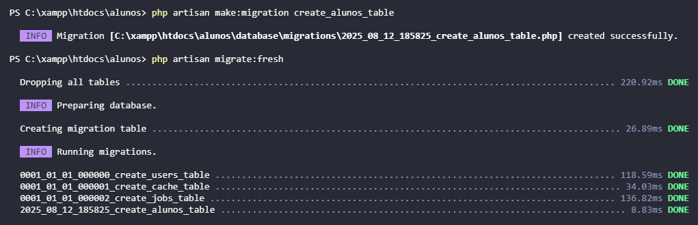

# 📚 Projeto Laravel - Alunos

Este projeto foi desenvolvido como parte da tarefa de instalação e configuração do **Laravel** com **MySQL**, incluindo a criação de uma migration para gerar a tabela `alunos` no banco de dados.

---

## 📌 Requisitos para execução

Antes de iniciar, certifique-se de ter os seguintes softwares instalados no seu ambiente:

- **PHP** (>= 8.0)
- **Composer** (gerenciador de dependências PHP)
- **MySQL** (instalado e rodando)
- **VS Code** ou outro editor de código

---

## 🚀 Tutorial

### 1️⃣ Instalação do Laravel

No terminal, execute o comando:

```bash
laravel new alunos
```

📷 **Print da instalação:**



---

### 2️⃣ Configuração do banco de dados

Edite o arquivo `.env` na raiz do projeto e configure as credenciais do seu banco MySQL:

```env
DB_CONNECTION=mysql
DB_HOST=127.0.0.1
DB_PORT=3306
DB_DATABASE=alunos
DB_USERNAME=root
DB_PASSWORD=
```

> ⚠️ Substitua os valores de `DB_DATABASE`, `DB_USERNAME` e `DB_PASSWORD` conforme o seu ambiente.

---

### 3️⃣ Criando a migration

Dentro da pasta do projeto, execute:

```bash
php artisan make:migration create_alunos_table
```

No arquivo gerado em `database/migrations/`, adicione os campos desejados:

```php
public function up(): void
{
    Schema::create('alunos', function (Blueprint $table) {
        $table->id();
        $table->string('nome');
        $table->string('telefone');
        $table->string('email')->unique();
        $table->string('motivo_contato');
        $table->text('mensagem');
        $table->timestamps();
    });
}
```

---

### 4️⃣ Rodando a migration

Execute no terminal:

```bash
php artisan migrate:fresh
```

📷 **Print da execução da migration:**



---

## 🗄 Arquivo SQL da tabela

O arquivo `alunos.sql` contém o script para criação da tabela diretamente no MySQL:

```sql
CREATE TABLE `alunos` (
  `id` bigint(20) UNSIGNED NOT NULL,
  `nome` varchar(255) NOT NULL,
  `telefone` varchar(255) NOT NULL,
  `email` varchar(255) NOT NULL,
  `motivo_contato` varchar(255) NOT NULL,
  `mensagem` varchar(255) NOT NULL,
  `created_at` timestamp NULL DEFAULT NULL,
  `updated_at` timestamp NULL DEFAULT NULL
) ENGINE=InnoDB DEFAULT CHARSET=utf8mb4 COLLATE=utf8mb4_unicode_ci;
```

---

## 🔗 Versionamento

O código completo está disponível no GitHub:

📌 **Repositório:** [https://github.com/ferreiraluizga/laravel-migrations](https://github.com/ferreiraluizga/laravel-migrations)

---
